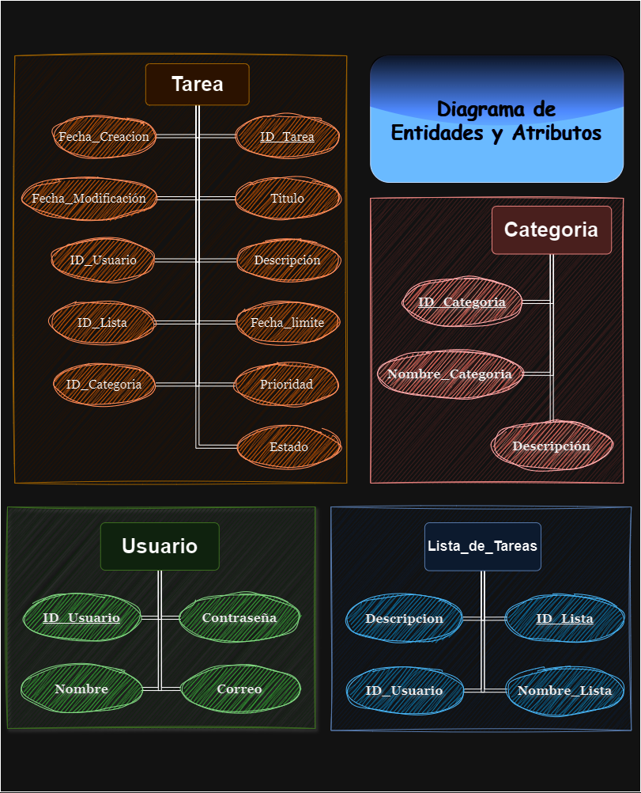
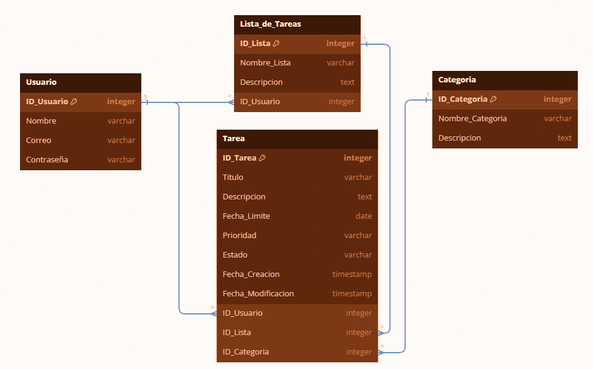

# To-Do List Application

## Presentación
Este proyecto fue realizado por **Santiago Delgado** para el curso **Desarrollador Full Stack** en el **Centro de Formación CILSA**. El objetivo del proyecto es desarrollar una aplicación web de Lista de Tareas (To-Do List) que permita a los usuarios gestionar sus tareas diarias de manera eficiente.

## Simulación del Cliente y su Pedido
**Situación Hipotética:**
Hola, tengo una idea para una aplicación web y me gustaría que me ayudaras a crearla. Lo que necesito es algo sencillo: una lista de tareas, un "to do list", para poder organizarme mejor. Quiero que la aplicación me permita agregar tareas, marcarlas como completadas cuando las haya terminado, y poder eliminarlas si ya no las necesito.

Me gustaría que también tuviera la opción de ordenar las tareas, tal vez por prioridad, y si se puede, que me mande recordatorios de las tareas importantes o que están por vencerse. No sé mucho de tecnología, así que me gustaría que sea fácil de usar, algo donde pueda ver todas mis tareas de un vistazo sin complicaciones. Y que pueda acceder desde mi computadora y también desde mi celular.

Primero, cuando entro, me gustaría ver una pantalla principal donde aparezcan todas mis tareas pendientes. Cada tarea debería mostrar el nombre de lo que tengo que hacer, una descripción corta si la agrego, la fecha límite para completar la tarea, y tal vez una prioridad que yo pueda establecer, como alta, media o baja. Quiero que cada tarea tenga un botón para marcarla como completada, y cuando lo haga, esa tarea debería moverse a otra sección o desaparecer de la lista principal.

También me gustaría poder organizar mis tareas en diferentes categorías o listas. Por ejemplo, una lista para tareas de trabajo, otra para cosas personales, y tal vez otra para proyectos específicos. Así puedo tener todo más ordenado.

Quisiera poder agregar tareas nuevas fácilmente, llenando un pequeño formulario donde pueda escribir el nombre de la tarea, la descripción, la fecha límite, y elegir la prioridad y la categoría a la que pertenece. Además, me gustaría poder editar una tarea si me equivoqué o si algo cambió, como la fecha o la prioridad.

Sería genial si puedo ver solo las tareas de una categoría a la vez, como si filtrara las tareas para concentrarme en lo que necesito hacer para cada aspecto de mi vida. También quiero poder buscar tareas específicas si tengo muchas y no las encuentro de inmediato.


**Resumen:**
Un cliente solicita el desarrollo de una aplicación web donde los usuarios puedan gestionar sus listas de tareas. El cliente describe que la aplicación debe permitir a los usuarios realizar las siguientes acciones:

- Agregar nuevas tareas.
- Marcar tareas como completadas.
- Editar tareas existentes.
- Eliminar tareas.

El cliente no tiene conocimientos técnicos, por lo que describe las funcionalidades en términos simples. Basándonos en su descripción, se diseñó un modelo entidad-relación para la base de datos.

## Modelo Entidad-Relación

**Entidades y Atributos:**

1. **Usuario:**
   - `ID_Usuario` (Clave primaria, INTEGER, AUTOINCREMENT)
   - `Nombre` (TEXT)
   - `Correo` (TEXT, UNIQUE)
   - `Contraseña` (TEXT)

2. **Tarea:**
   - `ID_Tarea` (Clave primaria, INTEGER, AUTOINCREMENT)
   - `Titulo` (TEXT)
   - `Descripcion` (TEXT)
   - `Fecha_Limite` (DATE)
   - `Prioridad` (TEXT)
   - `Estado` (TEXT)
   - `Fecha_Creacion` (TIMESTAMP)
   - `Fecha_Modificacion` (TIMESTAMP)
   - `ID_Usuario` (INTEGER, Clave foránea)
   - `ID_Categoria` (INTEGER, Clave foránea)
   - `ID_Lista` (INTEGER, Clave foránea)

3. **Categoria:**
   - `ID_Categoria` (Clave primaria, INTEGER, AUTOINCREMENT)
   - `Nombre_Categoria` (TEXT)
   - `Descripcion` (TEXT)

4. **Lista_de_Tareas:**
   - `ID_Lista` (Clave primaria, INTEGER, AUTOINCREMENT)
   - `Nombre_Lista` (TEXT)
   - `Descripcion` (TEXT)
   - `ID_Usuario` (INTEGER, Clave foránea)

**Relaciones:**

- Un **Usuario** puede tener muchas **Tareas**.
- Un **Usuario** puede tener muchas **Listas de Tareas**.
- Una **Tarea** pertenece a un **Usuario**.
- Una **Tarea** puede pertenecer a una **Categoría**.
- Una **Tarea** puede pertenecer a una **Lista de Tareas**.

## Diagramas del Proyecto

A continuación, se muestran los diagramas que representan el modelo entidad-relación y su estructura en la base de datos.





## Elección del Motor de Base de Datos

Se ha elegido **SQLite** como motor de base de datos para este proyecto. SQLite es una opción ligera y fácil de implementar, ideal para proyectos donde no se requiere una gran escalabilidad desde el inicio. Además, no necesita una configuración del servidor, lo que facilita su integración y uso.

## Comandos SQL para la Creación de Tablas

A continuación, se muestran los comandos SQL para la creación de la base de datos y las tablas:

```sql
-- Crear y abrir la base de datos
.open ToDoDB

-- Crear la tabla Usuario
CREATE TABLE Usuario (
    ID_Usuario INTEGER PRIMARY KEY AUTOINCREMENT,
    Nombre TEXT NOT NULL,
    Correo TEXT NOT NULL UNIQUE,
    Contraseña TEXT NOT NULL
);

-- Crear la tabla Categoria
CREATE TABLE Categoria (
    ID_Categoria INTEGER PRIMARY KEY AUTOINCREMENT,
    Nombre_Categoria TEXT NOT NULL,
    Descripcion TEXT
);

-- Crear la tabla Lista_de_Tareas
CREATE TABLE Lista_de_Tareas (
    ID_Lista INTEGER PRIMARY KEY AUTOINCREMENT,
    Nombre_Lista TEXT NOT NULL,
    Descripcion TEXT,
    ID_Usuario INTEGER,
    FOREIGN KEY (ID_Usuario) REFERENCES Usuario(ID_Usuario)
);

-- Crear la tabla Tarea
CREATE TABLE Tarea (
    ID_Tarea INTEGER PRIMARY KEY AUTOINCREMENT,
    Titulo TEXT NOT NULL,
    Descripcion TEXT,
    Fecha_Limite DATE,
    Prioridad TEXT,
    Estado TEXT,
    Fecha_Creacion TIMESTAMP DEFAULT CURRENT_TIMESTAMP,
    Fecha_Modificacion TIMESTAMP DEFAULT CURRENT_TIMESTAMP,
    ID_Usuario INTEGER,
    ID_Categoria INTEGER,
    ID_Lista INTEGER,
    FOREIGN KEY (ID_Usuario) REFERENCES Usuario(ID_Usuario),
    FOREIGN KEY (ID_Categoria) REFERENCES Categoria(ID_Categoria),
    FOREIGN KEY (ID_Lista) REFERENCES Lista_de_Tareas(ID_Lista)
);

```
## Comandos SQL para las Acciones CRUD
Aquí se presentan los comandos SQL para realizar las acciones de creación, listado, modificación y eliminación de tareas:

**1. Creación de una nueva tarea:**
```sql
INSERT INTO Tarea (Titulo, Descripcion, Fecha_Limite, Prioridad, Estado, Fecha_Creacion, Fecha_Modificacion, ID_Usuario, ID_Categoria, ID_Lista)
VALUES ('Comprar leche', 'Comprar en el supermercado', '2024-09-05', 'Alta', 'Pendiente', CURRENT_TIMESTAMP, CURRENT_TIMESTAMP, 1, 2, 1);
```

**2. Listar todas las tareas de un usuario:**
```sql
SELECT * FROM Tarea
WHERE ID_Usuario = 1;
```

**3. Modificar una tarea existente:**
```sql
UPDATE Tarea
SET Titulo = 'Comprar pan', Descripcion = 'Comprar en la panadería', Fecha_Limite = '2024-09-06', Prioridad = 'Media', Estado = 'Pendiente', Fecha_Modificacion = CURRENT_TIMESTAMP
WHERE ID_Tarea = 1;
```

**4. Eliminar una tarea:**
```sql
DELETE FROM Tarea
WHERE ID_Tarea = 1;
```
